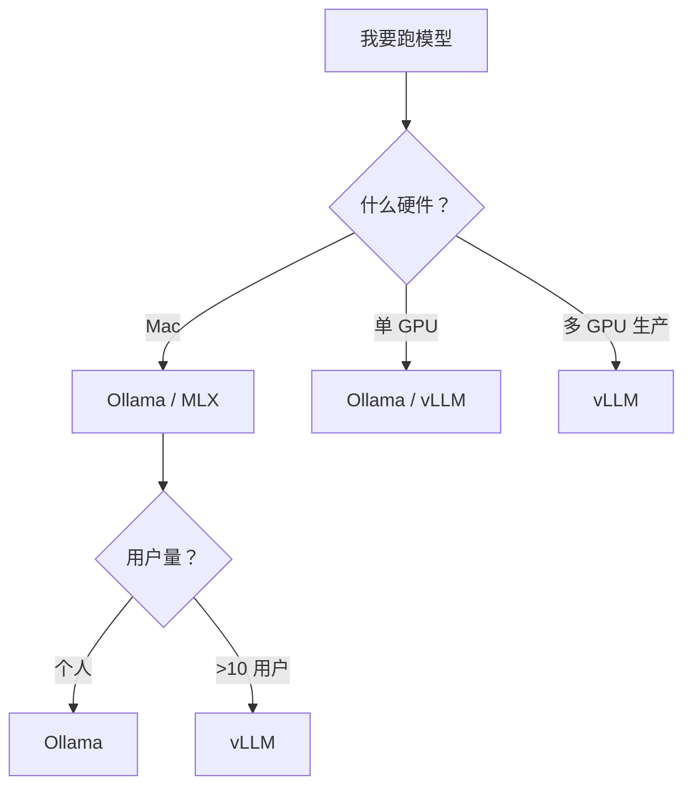
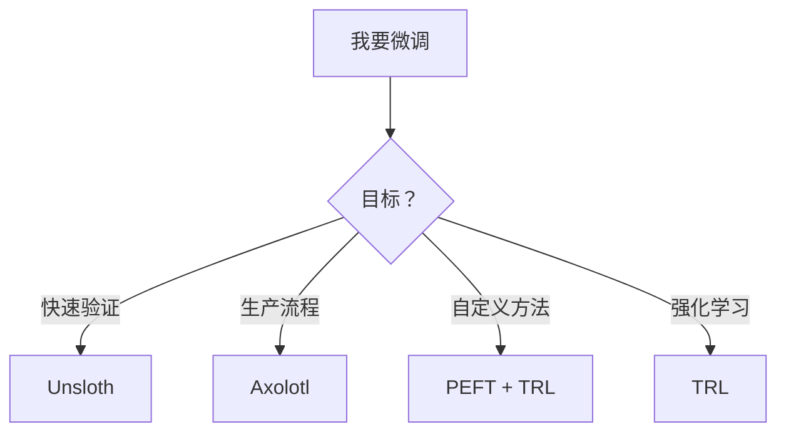

# 第 17 课：本地 AI 生态与工程工具全景

> 本课目标：理解完整的本地 AI 工具箱——从本地推理到模型微调，从工具选择到生产部署。学完这课，你就能根据不同场景选对工具，不再被各种框架搞晕。

---

## 1. 先说结论

LLM 工程不只是调一个 API。你要面对的是一个**完整的工具生态**：

```
本地推理  ← 跑模型、做服务
      ↓
模型微调  ← 让模型变聪明
      ↓
评估部署  ← 上线、监控、迭代
```

本课把**最核心的工具**全过一遍，每个工具告诉你：

| 工具 | 一句话 | 谁造的 |
|------|--------|--------|
| **llama.cpp** | 纯 C++ 推理引擎，CPU/GPU 都能跑 | 社区 |
| **Ollama** | 一键下载 + 运行本地模型 | 社区 |
| **vLLM** | 高吞吐生产级推理服务 | UC Berkeley |
| **MLX** | Apple Silicon 专属推理 | Apple |
| **Hugging Face** | 模型界的 GitHub | Hugging Face |
| **Unsloth** | 快 2 倍的 LoRA 训练 | 社区 |
| **Axolotl** | 配置文件驱动的微调框架 | 社区 |
| **PEFT** | 官方参数高效微调库 | Hugging Face |
| **TRL** | 强化学习微调（SFT/DPO/PPO） | Hugging Face |

> **底层逻辑：推理工具选快和省，微调工具选灵活和快。没有完美的工具，只有适合场景的工具。**

---

## 2. 生活类比：厨具齐全的厨房

想象你开餐厅：

**llama.cpp** = 一口万能铁锅。什么火候都能用，电磁炉（CPU）和燃气灶（GPU）都行。功能纯粹，但不方便。

**Ollama** = 智能电饭煲。按键就工作，"下载菜谱 → 煲汤"一步到位。适合日常做饭，但不够专业。

**vLLM** = 餐厅后厨流水线系统。几十个厨师同时出菜，效率极高——但需要专业的后厨团队维护。

**MLX** = 苹果定制厨具。只在 Mac 上能用，但用起来特别顺滑。

**Hugging Face** = 调料市场 + 食谱大全。你要的食材（模型）、配方（代码）都在这里。

**Unsloth / Axolotl / PEFT / TRL** = 不同的炒菜技法。有的快（Unsloth），有的可调参数多（Axolotl），有的适合改味道（PEFT），有的适合调火候（TRL）。

> **好厨师会同时用好几个工具。一个完整项目往往需要 3~5 个工具配合。**

---

## 3. 为什么跑本地模型？

### 理由 1：隐私和数据安全

你公司的客户数据不能发给 OpenAI。本地跑，数据不出门。

### 理由 2：离线可用

飞机上、偏远地区、网络隔离环境——本地模型随时能用。

### 理由 3：没有 API 费用

一次投入硬件后，推理是免费的。量大场景下比 API 便宜 10~100 倍。

### 理由 4：低延迟

网络请求至少 100ms 延迟。本地推理可做到 10ms。

### 理由 5：定制自由

想改模型？本地微调后直接跑，不需要等审核。

### 什么时候不适合本地？

| 场景 | 建议 |
|------|------|
| 需要 GPT-4 级别质量 | 别折腾，用 API |
| 团队没有 GPU | 也用 API |
| 大规模生产（百万级用户） | API 更稳定 |
| 需要多模态（图片/视频/语音） | 本地模型目前较弱 |

> **本地模型在小规模、隐私敏感、离线场景下性价比极高。但别为了省钱而牺牲用户体验。**

---

## 4. llama.cpp——一切本地推理的起点

### 这玩意是啥？

一个**纯 C++ 写的推理引擎**，没有 Python 依赖。最初由 Georgi Gerganov 开发，现在全社区维护。

### 为什么重要？

```python
# 传统推理（需要 PyTorch + CUDA + 一堆依赖）
pip install torch transformers ...
python run.py  # 光环境配置就半小时

# llama.cpp（单一二进制文件）
./llama-cli -m model.gguf -p "你好"
# 下载即用，零配置
```

**核心贡献：**

1. **GGUF 格式**：把模型打包成一个文件，像 `.zip` 一样方便
2. **CPU 优化**：不依赖 GPU 也能跑
3. **量化支持**：从 2bit 到 8bit，大小/质量自由选择
4. **跨平台**：Windows / Mac / Linux / 手机都能跑

### 量化级别

| 量化名 | 每参数位数 | 相对 FP16 大小 | 质量 |
|--------|:---------:|:--------------:|:----:|
| Q2_K | 2 bit | 12.5% | 差 |
| Q3_K_M | 3 bit | ~19% | 一般 |
| Q4_K_M | 4 bit | ~25% | **推荐，质量好** |
| Q5_K_M | 5 bit | ~31% | 更好 |
| Q6_K | 6 bit | ~38% | 几乎无损 |
| Q8_0 | 8 bit | 50% | 无损 |

> **Q4_K_M 是性价比之王。** 7B 模型只需 ~4 GB，质量掉不到 1%。

### GGUF 命名规则

```
Qwen2.5-7B-Instruct-Q4_K_M.gguf
├── 模型名     ├── 量化规格
     ├── 指令版
```

### 使用方式

```bash
# 下载 GGUF 文件
wget https://huggingface.co/.../model.gguf

# 运行
./llama-cli -m model.gguf -p "什么是 RAG？" -n 512

# 启动 API 服务
./llama-server -m model.gguf --port 8080

# 然后 curl 调用
curl http://localhost:8080/v1/chat/completions \
  -d '{"model":"model","messages":[{"role":"user","content":"你好"}]}'
```

---

## 5. Ollama——一键跑本地模型

### 这玩意是啥？

**基于 llama.cpp 的封装**，把下载和运行变成两条命令。

```bash
# 下载一个模型
ollama pull qwen2.5:7b

# 运行
ollama run qwen2.5:7b

# 一行命令启动 API 服务（默认 11434 端口）
# 然后任何 OpenAI SDK 都能连
```

### 支持什么模型？

从 Llama 3、Qwen 2.5、Mistral、DeepSeek 到 Phi、Gemma 都有。

### 模型库在哪？

https://ollama.com/library 像 App Store 一样浏览。

### Modelfile——定制模型

```dockerfile
# Modelfile
FROM qwen2.5:7b

# 改系统提示词
SYSTEM "你是一个中医助手，用文言文回答"

# 改温度参数
PARAMETER temperature 0.3

# 改上下文长度
PARAMETER num_ctx 8192
```

```bash
ollama create my-model -f Modelfile
ollama run my-model
```

### Ollama vs 原生 llama.cpp

| 维度 | Ollama | llama.cpp |
|------|--------|-----------|
| 上手难度 | ⭐ 极简 | ⭐⭐ 简单 |
| 定制自由度 | 有限 | 完全自由 |
| 自动下载 | ✅ | ❌ 手动 |
| 轻量化 | 有额外守护进程 | 最精简 |
| 生产使用 | 个人/小团队 | 可嵌入其他工具 |

> **99% 的个人用户用 Ollama 就够了。** 只有你需要做定制开发时才需要直接操作 llama.cpp。

---

## 6. vLLM——生产级推理引擎

### 前三课提到了 vLLM，这里细讲

vLLM 由 UC Berkeley 开发，是目前**最流行的生产级推理框架**。

### 核心能力

- **PagedAttention**：像操作系统的虚拟内存管理 KV cache，利用率从 20% 提升到 90%
- **Continuous batching**：请求随时加入，GPU 利用率 95%+
- **多种量化支持**：AWQ、GPTQ、FP8
- **OpenAI 兼容 API**：一行代码替换 OpenAI

```python
# 安装
# pip install vllm

# 启动服务（命令行）
# vllm serve Qwen/Qwen2.5-7B-Instruct --dtype auto --max-model-len 8192

# Python 调用
from openai import OpenAI

client = OpenAI(
    base_url="http://localhost:8000/v1",
    api_key="not-needed"
)

response = client.chat.completions.create(
    model="Qwen/Qwen2.5-7B-Instruct",
    messages=[{"role": "user", "content": "你好"}]
)
```

### vLLM vs Ollama

| 维度 | vLLM | Ollama |
|------|------|--------|
| 定位 | 生产级部署 | 个人/开发 |
| 吞吐量 | 极高 | 一般 |
| 并发处理 | 上百请求 | 几个请求 |
| 显存管理 | PagedAttention | 普通管理 |
| 配置复杂度 | 中等 | 极简 |
| 场景 | 生产 API | 本地体验/开发 |

> **vLLM 适合：你要给 >10 个用户提供 API 服务。Ollama 适合：你一个人调模型玩。**

---

## 7. MLX——Apple Silicon 的专属利器

### 这玩意是啥？

Apple 官方出的**机器学习框架**，专门为 M 系列芯片优化。

### 为什么特殊？

```python
# PyTorch 在 Mac 上
import torch
# 需要 MPS 后端支持，性能一般

# MLX 在 Mac 上
import mlx.core as mx
# 原生为 Apple Silicon 优化，快得多
```

### 核心优势

| 特性 | 说明 |
|------|------|
| **统一内存** | CPU 和 GPU 共享内存，不需要显存搬运 |
| **Apple Silicon 优化** | 充分利用 M 系列芯片的 NPU（神经网络引擎） |
| **内存效率** | 7B 模型在 16GB Mac 上也能跑 |
| **SDK 原生** | Objective-C/Swift 可以直接调用 |

### 使用方式

```python
# 推理
from mlx_lm import load, generate

model, tokenizer = load("mlx-community/Qwen2.5-7B-Instruct-4bit")

response = generate(model, tokenizer, prompt="你好")
print(response)

# 微调（MLX 内置 LoRA 训练）
# mlx_lm.lora --model mlx-community/... --data ./data --train
```

### Mac 用户选哪个？

| 场景 | 推荐 |
|------|------|
| 只想跑模型 | Ollama（底层就用 MLX 优化） |
| 在 Mac 上开发应用 | 直接 MLX Python SDK |
| 需要 Swift 集成 | MLX Swift 库 |
| 需要分布式 | 别用 Mac，用 GPU 服务器 |

> **如果你只有 Mac，MLX 是推理速度最快的选择。** 但它不支持 Windows 和 Linux。

---

## 8. Hugging Face 生态——模型界的 GitHub

### 这玩意是啥？

Hugging Face 是**AI 模型托管平台**，就像 GitHub 是代码托管平台。

### 四大核心产品

| 产品 | 类比 | 一句话 |
|------|------|--------|
| **Models** | GitHub 代码仓库 | 50 万+ 模型，随便下载 |
| **Datasets** | 数据市场 | 各种训练数据集 |
| **Spaces** | 演示站 | 一键部署模型体验 Demo |
| **Transformers** | Python 库 | 一行代码加载任何模型 |

### Transformers 库——通用模型加载器

```python
from transformers import AutoModelForCausalLM, AutoTokenizer

# 任何 Hugging Face 上的模型都能这样加载
model_name = "Qwen/Qwen2.5-7B-Instruct"

tokenizer = AutoTokenizer.from_pretrained(model_name)
model = AutoModelForCausalLM.from_pretrained(
    model_name,
    device_map="auto",  # 自动分配 GPU/CPU
    load_in_4bit=True   # 4bit 量化加载
)

# 推理
inputs = tokenizer("你好", return_tensors="pt")
outputs = model.generate(**inputs, max_new_tokens=100)
print(tokenizer.decode(outputs[0]))
```

> **Transformers 是 Hugging Face 生态的核心入口。** 向下兼容所有主流模型。

---

## 9. Hugging Face CLI——命令行管理模型

### 安装

```bash
pip install huggingface_hub
huggingface-cli login  # 登录（需要 token）
```

### 常用命令

```bash
# 搜索模型
huggingface-cli search qwen --limit 5

# 下载模型
huggingface-cli download Qwen/Qwen2.5-7B-Instruct \
  --local-dir ./my-model

# 下载单个文件（比如 GGUF）
huggingface-cli download \
  Qwen/Qwen2.5-7B-Instruct-GGUF \
  qwen2.5-7b-instruct-q4_k_m.gguf \
  --local-dir ./models

# 上传模型
huggingface-cli upload my-user/my-model ./model.gguf

# 创建仓库
huggingface-cli repo create my-model --type model

# 查看模型信息
huggingface-cli model-info Qwen/Qwen2.5-7B-Instruct
```

### 环境变量

```bash
# 设置国内镜像（下载加速）
export HF_ENDPOINT=https://hf-mirror.com

# 设置代理
export HF_TOKEN=hf_xxxxxxxxxxxxxxxx
```

> **CLI 比网页方便 100 倍。** 尤其是在服务器上、脚本中批量操作。

---

## 10. Unsloth——快 2 倍的 LoRA 微调引擎

### 这玩意是啥？

一句话：**LoRA 微调的加速器**，比标准 PEFT 快 2 倍、省 50% 显存。

### 为什么快？

```python
# 标准 PEFT 微调（慢）
from peft import LoraConfig, get_peft_model
model = get_peft_model(base_model, LoraConfig(...))

# Unsloth 微调（快 2 倍）
from unsloth import FastLanguageModel
model, tokenizer = FastLanguageModel.from_pretrained(
    model_name="Qwen/Qwen2.5-7B-Instruct",
    max_seq_length=4096,
    load_in_4bit=True,
)
model = FastLanguageModel.get_peft_model(model, ...)
```

| 维度 | PEFT | Unsloth |
|------|------|---------|
| 训练速度 | 基准 | **2x 更快** |
| 显存消耗 | 基准 | **省 50%** |
| 支持模型 | 所有 | 主要开源模型优化 |
| 安装 | 简单 | 需要编译（可 pip） |

### 核心优化原理

1. **手动优化的注意力内核**：比 PyTorch 原生实现更高效
2. **更少的内存分配**：减少 GPU 显存碎片
3. **4bit 反量化优化**：QLoRA 场景下速度提升更明显

### 训练示例

```python
from unsloth import is_bfloat16_supported
from unsloth import UnslothTrainer, UnslothTrainingArguments

trainer = UnslothTrainer(
    model=model,
    tokenizer=tokenizer,
    train_dataset=dataset,
    args=UnslothTrainingArguments(
        per_device_train_batch_size=2,
        gradient_accumulation_steps=4,
        learning_rate=2e-4,
        output_dir="./outputs",
    ),
)
trainer.train()
```

> **如果你要快速验证微调效果（1~2 天内），Unsloth 是最好的选择。**

---

## 11. Axolotl——配置驱动的生产微调

### 这玩意是啥？

**YAML 配置文件驱动的微调框架**。一个文件定义所有参数，团队内轻松复现。

### 为什么需要 Axolotl？

手写训练脚本容易出 bug，参数散落各处，换个人就不知道怎么跑了。

Axolotl 的做法：

```yaml
# config.yml — 训练的全部参数
model:
  base_model: Qwen/Qwen2.5-7B-Instruct
  load_in_4bit: true
  bf16: auto

lora:
  r: 16
  lora_alpha: 32
  lora_dropout: 0.05
  target_modules: [q_proj, v_proj, k_proj, o_proj]

training:
  batch_size: 4
  learning_rate: 2e-4
  num_epochs: 3
  warmup_steps: 100
  optimizer: adamw_bnb_8bit

datasets:
  - path: ./data/train.jsonl
    type: sharegpt

output_dir: ./outputs
```

```bash
# 一行开始训练
accelerate launch -m axolotl.cli.train config.yml

# 合并 LoRA 权重
accelerate launch -m axolotl.cli.merge_lora config.yml
```

### Axolotl vs Unsloth

| 维度 | Axolotl | Unsloth |
|------|---------|---------|
| 配置方式 | YAML 配置文件 | Python 代码 |
| 速度 | 标准 | 2x 更快 |
| 完整微调 | ✅ 全量、LoRA、QLoRA | ✅ LoRA、QLoRA |
| 团队协作 | ⭐⭐⭐（配置可复现） | ⭐⭐（代码需要注释） |
| 上手难度 | ⭐⭐⭐（参数多） | ⭐（简单） |

> **团队项目用 Axolotl，个人快速实验用 Unsloth。**

---

## 12. PEFT——官方参数高效微调库

### 这玩意是啥？

Hugging Face 官方出品的**参数高效微调（Parameter-Efficient Fine-Tuning）库**，包含多种方法。

### 支持的微调方法

| 方法 | 原理 | 参数量 | 适用场景 |
|------|------|:-----:|---------|
| **LoRA** | 低秩矩阵分解 | 0.1~1% | 最通用 |
| **QLoRA** | 4bit + LoRA | 0.1% | 显存受限 |
| **Prefix Tuning** | 在输入前加可学习前缀 | 0.1% | 生成任务 |
| **P-Tuning** | 在 embedding 层加可学习向量 | 0.01% | 自然语言理解 |
| **IA³** | 缩放注意力和 FFN | 极少 | 极轻量级 |
| **AdaLoRA** | 自适应分配 LoRA rank | 0.1% | 效果更好但更慢 |

### PEFT + Transformers 配合使用

```python
from transformers import AutoModelForCausalLM
from peft import LoraConfig, get_peft_model, TaskType

# 1. 加载基础模型
model = AutoModelForCausalLM.from_pretrained("Qwen/Qwen2.5-7B-Instruct")

# 2. 配置 LoRA
lora_config = LoraConfig(
    r=16,                # 秩（越大容量越大）
    lora_alpha=32,       # 缩放系数
    target_modules=["q_proj", "v_proj"],  # 只改 Q 和 V 矩阵
    lora_dropout=0.05,   # 防过拟合
    bias="none",
    task_type=TaskType.CAUSAL_LM,
)

# 3. 应用 LoRA
peft_model = get_peft_model(model, lora_config)

# 4. 查看可训练参数量
peft_model.print_trainable_parameters()
# 输出：trainable params: 4.2M / 7B = 0.06%

# 5. 训练（和普通 Transformers 一样）
from transformers import Trainer
trainer = Trainer(model=peft_model, ...)
trainer.train()

# 6. 保存/加载适配器
peft_model.save_pretrained("./my-adapter")
```

> **PEFT 是所有微调的基础设施。** Unsloth 和 Axolotl 底层都用了 PEFT，只是加了优化。

---

## 13. TRL——强化学习微调

### 这玩意是啥？

Hugging Face 出品的**Transformer Reinforcement Learning**库。让模型从人类偏好中学习。

### 核心方法

| 方法 | 全称 | 一句话 |
|------|------|--------|
| **SFT** | Supervised Fine-Tuning | 监督微调，标准指令微调 |
| **DPO** | Direct Preference Optimization | 直接用偏好数据优化，不需要奖励模型 |
| **PPO** | Proximal Policy Optimization | 传统 RLHF，需要奖励模型，效果更好但更复杂 |
| **GRPO** | Group Relative Policy Optimization | DeepSeek 用的方案，比 PPO 稳定 |

### SFT——指令微调

```python
from trl import SFTTrainer

trainer = SFTTrainer(
    model=model,
    train_dataset=dataset,
    tokenizer=tokenizer,
    args=dict(
        per_device_train_batch_size=4,
        learning_rate=2e-5,
    ),
)
trainer.train()
```

### DPO——偏好优化

```python
from trl import DPOTrainer

# 需要成对数据：chosen（好回答）vs rejected（坏回答）
# {"prompt": "...", "chosen": "...", "rejected": "..."}

dpo_trainer = DPOTrainer(
    model=model,
    ref_model=ref_model,  # 参考模型（DPO 需要）
    train_dataset=dpo_dataset,
    tokenizer=tokenizer,
    args=dict(beta=0.1),  # beta 控制 KL 散度惩罚力度
)
dpo_trainer.train()
```

### PPO——全流程 RLHF

```python
from trl import PPOTrainer, AutoModelForCausalLMWithValueHead

# PPO 需要：
# 1. 策略模型（Policy）→ 生成回答
# 2. 价值模型（Value）→ 估计奖励
# 3. 奖励模型（Reward）→ 给分

model = AutoModelForCausalLMWithValueHead.from_pretrained("...")
ppo_trainer = PPOTrainer(
    model=model,
    tokenizer=tokenizer,
)
```

> **SFT → DPO 是目前最主流的微调路径，效果接近 PPO 但简单得多。**

---

## 14. 工具选择决策指南

### 推理工具



| 你的情况 | 推荐 | 理由 |
|----------|------|------|
| 个人 MacBook 上玩 | **Ollama** | 一行命令 |
| 个人 Windows 上玩 | **Ollama** | 跨平台 |
| 给团队做个 API | **vLLM** | 高吞吐 |
| 嵌入到 App 中 | **llama.cpp** | 最轻量 |
| 生产环境高并发 | **vLLM + AWQ** | 极致性能 |
| 写 Swift/ObjC App | **MLX + Swift** | Apple 原生 |

### 微调工具



| 你的情况 | 推荐 | 理由 |
|----------|------|------|
| 第一次微调 | **Unsloth** | 最快出结果 |
| 团队项目、可复现 | **Axolotl** | YAML 配置 |
| 需要 LoRA 之外的 PEFT 方法 | **PEFT** | 最全面 |
| 要做 RLHF/DPO | **TRL** | 官方最佳 |
| 想要极致速度 | **Unsloth** | 2x 加速 |
| 做全量微调（Full Fine-Tune） | **Axolotl** | 参数可控 |

### 一个完整项目的工作流

```bash
# 第 1 步：下载模型（Hugging Face CLI）
huggingface-cli download Qwen/Qwen2.5-7B-Instruct

# 第 2 步：用 Unsloth 快速微调
python train_unsloth.py  # 几个小时

# 第 3 步：导出 GGUF
python convert_to_gguf.py

# 第 4 步：用 Ollama 加载测试
ollama create my-model -f Modelfile
ollama run my-model

# 第 5 步：上线生产用 vLLM
vllm serve ./my-model-gguf
```

> **一个完整项目 = 下载（HF CLI）→ 微调（Unsloth/Axolotl）→ 导出（GGUF）→ 本地测试（Ollama）→ 上线（vLLM）。**

---

## 15. 一张图总结生态

```
┌─────────────────────────────────────────────────────┐
│                    推理工具                            │
│  ┌─────────┐  ┌─────────┐  ┌──────┐  ┌─────────┐   │
│  │llama.cpp│  │ Ollama  │  │ vLLM │  │   MLX   │   │
│  │(底层引擎)│  │(一键运行)│  │(高吞吐)│  │(苹果专用)│   │
│  └─────────┘  └─────────┘  └──────┘  └─────────┘   │
│                         │                           │
├─────────────────────────┼───────────────────────────┤
│                    模型生态                            │
│  ┌──────────────────────┼──────────────────────┐    │
│  │       Hugging Face（模型、数据集、Spaces）       │    │
│  └──────────────────────┼──────────────────────┘    │
│                         │                           │
├─────────────────────────┼───────────────────────────┤
│                    微调工具                            │
│  ┌──────────┐ ┌────────┐ ┌──────┐ ┌──────────┐    │
│  │ Unsloth  │ │Axolotl │ │PEFT │ │   TRL    │    │
│  │ (快2倍)  │ │(配置化)│ │(方法库)│ │(强化学习)│    │
│  └──────────┘ └────────┘ └──────┘ └──────────┘    │
└────────────────────────────────────────────────────┘
```

### 记住核心原则

| 原则 | 解释 |
|------|------|
| **推理选快的** | vLLM / Ollama 二选一，别自己造轮子 |
| **微调选灵活的** | PEFT + TRL 是基础，Unsloth/Axolotl 是包装 |
| **模型从 HF 下载** | GGUF 用于本地，Safetensors 用于训练 |
| **生产没有银弹** | 一个项目往往用 3~5 个工具组合 |
| **不要过度工程** | 小项目 Ollama 就够了，别上 vLLM |

---

## 下一课

[第 18 课：评估、成本和产品落地](./18-evaluation-costs-product)
